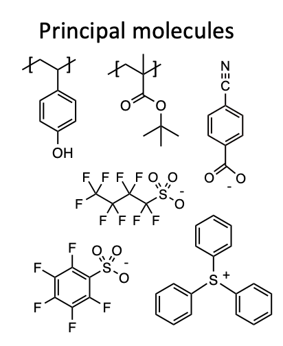

# GMC 

Three examples of applications of `GMC`, cobalt-catalyzed hydroformylation, solid-electrolyte interphase formation, and a system where energy is added, are provided.

## GMC -  Homogeneous Catalysis 

We apply our `GMC` module to simulating [cobalt-catalyzed hydroformylation](https://pubs.rsc.org/en/content/articlehtml/2017/sc/c7sc03628k). This application is choosen as an example because it has widely been studied and is a relatively simple organometallic reaction.

The following diagram outlines the reaction network of cobalt-catalyzed hydroformylation. The circles indicate different species and the solid lines indicate reactions. The numerical values inside the circles correspond to the species IDs used in the Python code to generate the .sqlite files to run `GMC` (see <a href="{{ site.github.repository_url }}"> examples directory</a>).

<figure>
    
    <figcaption> Final reaction network for the hydroformylation reaction.  </figcaption>
</figure>

## GMC -  Solid-Electrolyte Interphase 

We apply the `GMC` module to study the solid-electrolyte interphase formation and evolution. Graph-based CRNs with optimal pathways to two SEI products, lithium ethylene dicarbonate and lithium ethylene monocarbonate and constructed and filted with the High-Performance Reaction Generation (HiPRGen). We then use the `GMC` module to sample the resulting reactive space and determine products of the HiPRGen-constructed network. Further details of this work are outlined [here](https://chemrxiv.org/engage/api-gateway/chemrxiv/assets/orp/resource/item/61c509e6f52bc461dacb7766/original/template-free-reaction-networks-enable-predictive-and-automated-analysis-of-complex-electrochemical-reaction-cascades.pdf).

## GMC -  EUV Lithography 

We also apply the `GMC` module to study EUV Lithography, a system where some amount of energy is pumped into the system. In this example a 92 eV photon is abosrbed which enables 92 eV work of dG > 0 reactions. The principal molecules for the real full system are shown below. 

<figure>
    
    <figcaption> Principle molecules for full EUV Lithography System  </figcaption>
</figure>

This example contains a small subset of this overall system.