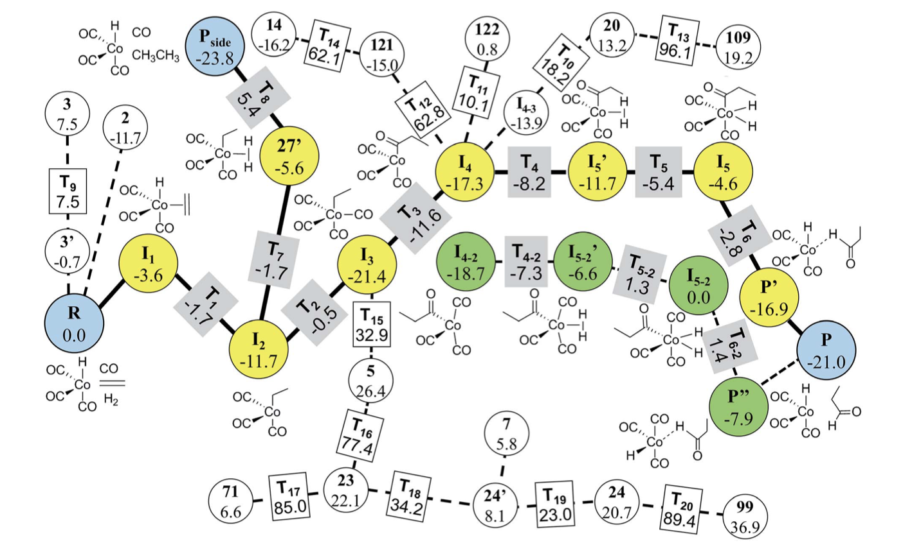

# Examples

For each module of `RNMC` an simple example of its use in an appropriate application is demonstrated. This includes a description of the example, Python code for generating the necessary .sqlite files, and sample outputs. The Python code and sample outputs are inside the <a href="{{ site.github.repository_url }}"> examples directory</a>.

# GMC -  Homogeneous Catalysis 
A simple example of an application of GMC is [homogeneous catalysis](./https://pubs.rsc.org/en/content/articlehtml/2017/sc/c7sc03628k). The following reaction network is employed. The circles indicate the reactants, products, and intermediates, while the rectangles indicate the transition states. The thick lines and the yellow circles denote the Heck–Breslow mechanism to give the product (P) and the hydrogenation mechanism to form the side product (Pside). The other paths are drawn with dashed lines. The green circles indicate the stereoisomers of the intermediates in the Heck–Breslow mechanism. The numbers in the circles and the rectangles denote the relative energies of intermediates and transition states with respect to that of the reactant (R), respectively. All the energy values are in kcal mol-1. 

<figure>
    
    <figcaption> Final reaction network for the hydroformylation reaction obtained at the DFT level.  </figcaption>
</figure>