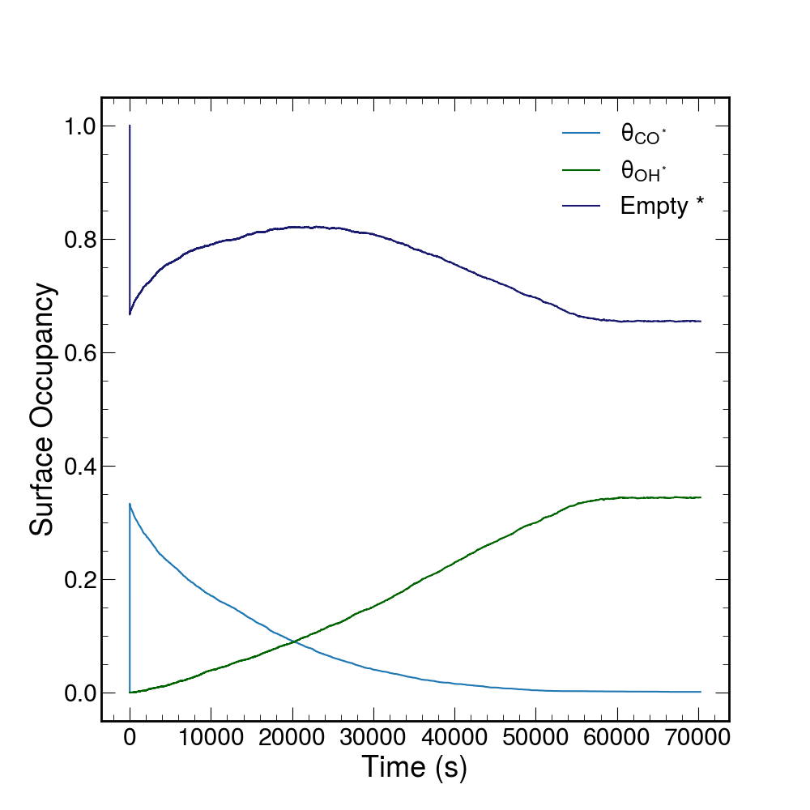

# LGMC
Two examples of applications of LGMC, CO Oxidation on Cu with a static lattice, and a simple reaction network for the formation and evolution of the solid electrolyte interphase (SEI) in a lithium-ion battery, are provided. 

## LGMC (static) -  CO Oxidation on Cu 
This example simulates electrocatalytic CO oxidation on Cu. We employ a static lattice with 50 sites in each of the x and y dimensions and 2 sites in the z dimension to represent a Cu surface as the catalysis. 

All initial sites are empty. The initial state of the solution in contact with this surface consists of 2,500 CO molecules and 15,000 H2O molecules. The reduction and oxidation rates use an electron free energy of -0.5 eV. The system is modeled at 300K. Butler-Volmer electron transfer theory is used through the simulation.

The allowed reactions and associated rates are as follows:

| Reaction                                 | Prefactor | Rate (s-1) |
|------------------------------------------|-----------|---------------|
| COsoln + * &rarr; CO*           | 1         | 105       |
| * + H2O(soln) &rarr; H2O*   | 1         | 102       |
| H2O* → * + H2O(soln)    | 1         | 102        |
| H2O → OH + e-      | 0.02      | 0             |
| OH* + e- → H2O*          | 104    | 0             |
| CO* + OH* → CO2* + e-  | 0.8432    | 0             |
| CO2* → * + CO2(soln)     | 1         | 104       |
| CO* + * → * + CO*            | 1         | 1             |
| OH* + * → * + OH*            | 1         | 1             |

From this initial state, 200,000 steps of our kMC are run. As the simulation proceeds, CO and H2O rapidly adsorbs onto the lattice. The H2O on the lattice then oxidizes to form OH which reacts with the CO on the lattice to form CO2. This CO2 lattice product then desorbs into the solution. The results of the simulation are shown as the occupancy of the lattice sites.

<figure>
    
    <figcaption>Surface occupancy for CO and OH where empty represents a site that contains neither CO or OH. </figcaption>
</figure>

## LGMC (dynamic) -  Solid Electrolyte Interphase  
This example simulates a simplified formation and evolution of the solid electrolyte interphase in a lithium-ion battery. 

Because there are 99 total reactions allowed to occur in the simulation, a brief overview is provided instead of a table. To see each reaction see the Python and .sqlite files in <a href="{{ site.github.repository_url }}"> examples directory </a>. 

### Species
EC0, EC-, LiEC+, LiEC0, LiEC_RO0, LiEC_RO-,
LiCO3-, Li2CO30, LEDC0, LEDC-, LEDC_minus_Li-, LEDC_plus_Li+, LEDC_plus_Li0, C2H40

### Overview:
- Each reaction can occur in either phase (lattice or homogeneous)
- The following solid products have fast adsorption rates: LiCO3-, Li2CO30, LEDC0, LEDC-, LEDC_minus_Li-, LEDC_plus_Li+, LEDC_plus_Li0
- Technically any of the EC-like species (EC0, EC-, LiEC+, LIEC0, LiEC_RO0, LiEC_RO-) should also be able to adsorb, but to keep the model simple that is not allowed
- The only species that desorbs fast is C2H4. The species LiCO3- is allowed to desorb at a very slow rate  
- Through the hopping reactions, lattice diffusion of Li+ is captured (which is the most important). 

### Calculating rates
- The molecular thermodynamics are in "test_species_thermo.json"
- Non-electrochemical reactions are in "test_energy_barriers.json" 
- For the hopping reactions (in "test_hopping_reactions.json"), the barrier is based on what Li was hopping from. For LiEC+, for instance, the barrier is 0.27 eV (based on the residence time of Li+ with EC solvation shells), but for LEDC0 it's 0.64 eV (based on values taken from the literature).
- Inner reorganization energies for reduction reactions are in "test_lambda_inner.json"
- For outer reorganization energies, we use 0.32 eV. 

