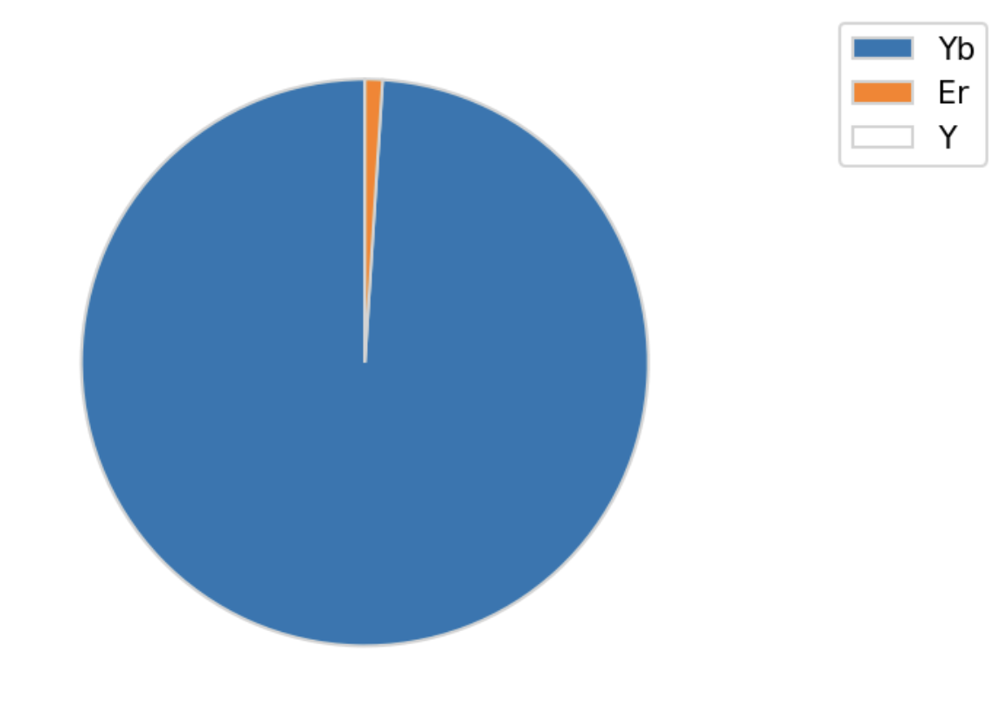
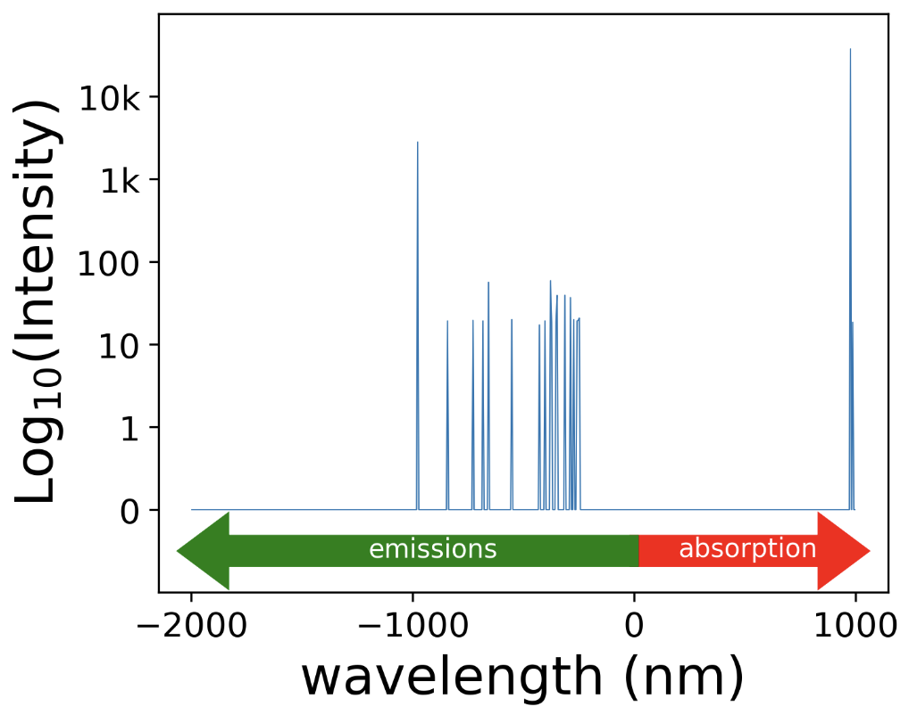

# NPMC
An example of applications of `NPMC` to simulating a doped nanoparticle is provided below.

## NGMC -  Doped Nanoparticle 

We apply our `NPMC` module to simulating doped nanoparticle using the [nanoparticle tools](https://github.com/BlauGroup/NanoParticleTools). The simulation is run for a 3nm diameter nanoparticle fromed with a NaYF4 host, with Yb and Er doped on the Y sites. The nanoparticle is to be excited with 980nm light at a power of 100,000 W/cm2. 

<figure>
    
    <figcaption> Visualization of doped nanoparticle  </figcaption>
</figure>

We simulate for 100k steps, although for production, we recommend at least 20M steps or a total of 10 milliseconds. 

Once the simulation is run, using the [nanoparticle tools](https://github.com/BlauGroup/NanoParticleTools), the average results can be calculated. From this the simulation spectra is plotted to determine if there are UV emissions. Detailed steps of using the [nanoparticle tools](https://github.com/BlauGroup/NanoParticleTools) are shown in the Jupyter Notebook inside the (see <a href="{{ site.github.repository_url }}"> examples directory</a>). 

<figure>
    
    <figcaption> Doped nanoparticle spectra  </figcaption>
</figure>

As can be seen on the spectra above, the particle does not emit in the UV region, given the laser conditions.